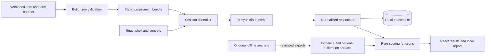
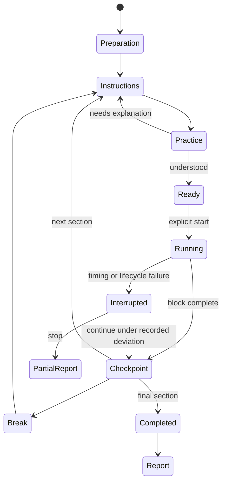

# Repository and application architecture

This document describes the intended implementation. Only the planning documents and design study currently exist.

## 1. Architecture decision

Use **one TypeScript application with explicit internal boundaries**. One frontend build deploys to GitHub Pages. Separate modules handle content, session administration, trial rendering, scoring, persistence, and reports. The statistical work, if it becomes possible, runs offline and exports reviewed static artifacts.

Do not begin with a monorepo package framework, a plugin marketplace, microservices, or a generic platform for every psychological test. There is one assessment. Modular code and validated content contracts give it room to grow without adding deployment boundaries prematurely.



## 2. Stack and responsibility

| Technology | Responsibility |
| --- | --- |
| React + TypeScript | Public pages, onboarding, section boundaries, reports, accessible UI |
| Vite | Development/build, split bundles, static asset handling |
| Tailwind CSS | Shared theme tokens and layout/style utilities |
| React Router | Hash routes for the interactive application |
| jsPsych | Trial sequence, presentation lifecycle, response capture |
| Zod | Runtime validation at content, storage, import, and optional API boundaries |
| IndexedDB + `idb` | Structured local attempts, checkpoints, reports, manifests |
| `localStorage` | Small preferences only, under an application-specific key |
| SVG | Stimulus geometry, original diagrams, simple result charts |
| Vitest + React Testing Library | Pure logic and component behavior |
| Playwright | Complete user flows, browser behavior, visual regression |
| ESLint + Prettier | Import boundaries, linting, and consistent formatting |
| npm + lockfile | Repeatable dependency installation |
| GitHub Actions + Pages | CI and static publication |
| Optional R + `renv` | Reproducible analysis, outside the production browser |

Pin supported stable versions when implementation begins and record the runtime/lockfile. Do not turn this dated plan into permanent advice to use a moving `latest` dependency. Follow the [current Tailwind Vite integration](https://tailwindcss.com/docs/installation/using-vite) for the pinned release rather than mixing old configuration patterns.

### Planned contributor commands

| Command | Expected behavior once implemented |
| --- | --- |
| `npm ci` | Install the committed dependency graph |
| `npm run dev` | Start the application locally |
| `npm run typecheck` | Run strict TypeScript checking without emitting files |
| `npm run lint` / `npm run format:check` | Check code, boundaries, and formatting |
| `npm run content:check` | Validate items, forms, provenance, and semantic invariants |
| `npm run assets:build` / `npm run assets:check` | Generate and compare deterministic stimulus artifacts |
| `npm test` | Run focused logic/component tests |
| `npm run test:e2e` | Exercise the short synthetic assessment across configured browsers |
| `npm run build` / `npm run preview` | Build and inspect the production Pages artifact |

Document a single Windows-compatible path through these commands. A contributor should not need a Unix shell or an R installation to improve the frontend. Analysis commands belong in `analysis/README.md` when that work exists.

## 3. Planned repository tree

Create directories when their first real feature lands; this is an ownership map, not an instruction to generate empty placeholders.

```text
open-iq/
├─ README.md
├─ LICENSE                         # original software; proposed Apache-2.0
├─ CONTENT-LICENSE.md              # original content; proposed CC BY 4.0
├─ THIRD_PARTY_NOTICES.md
├─ CONTRIBUTING.md
├─ CODE_OF_CONDUCT.md
├─ SECURITY.md
├─ CITATION.cff
├─ CHANGELOG.md
├─ package.json
├─ package-lock.json
├─ .nvmrc
├─ .editorconfig
├─ .gitignore
├─ .github/
│  ├─ CODEOWNERS
│  ├─ ISSUE_TEMPLATE/              # bug, item ambiguity, accessibility
│  ├─ pull_request_template.md
│  ├─ dependabot.yml
│  └─ workflows/
│     ├─ ci.yml
│     └─ deploy.yml
├─ index.html
├─ vite.config.ts
├─ tsconfig.json
├─ eslint.config.js
├─ prettier.config.js
├─ playwright.config.ts
├─ src/
│  ├─ app/
│  │  ├─ App.tsx
│  │  ├─ router.tsx
│  │  └─ layouts/                 # public, assessment, report
│  ├─ domain/
│  │  ├─ content.schema.ts
│  │  ├─ session.schema.ts
│  │  ├─ report.schema.ts
│  │  └─ evidence.schema.ts
│  ├─ assessment/
│  │  ├─ session/                 # pure transitions and administration rules
│  │  ├─ runtime/                 # jsPsych boundary and trial lifecycle
│  │  │  └─ plugins/              # only task behavior not covered by existing plugins
│  │  ├─ scoring/                 # pure raw/model/eligibility/report functions
│  │  └─ stimuli/                 # deterministic SVG/geometry, no React dependency
│  ├─ features/
│  │  ├─ home/
│  │  ├─ preparation/
│  │  ├─ assessment/
│  │  ├─ results/
│  │  ├─ methodology/
│  │  └─ local-data/
│  ├─ ui/                         # actual shared controls, not copied template kit
│  ├─ platform/
│  │  ├─ storage.ts
│  │  ├─ clock.ts
│  │  ├─ export.ts
│  │  └─ import.ts
│  ├─ generated/                  # reproducible build outputs; generally ignored
│  └─ styles/
│     ├─ theme.css
│     ├─ global.css
│     └─ print.css
├─ content/
│  ├─ items/
│  │  ├─ matrix/
│  │  ├─ number-relations/
│  │  ├─ rotation/
│  │  ├─ paper-folding/
│  │  ├─ word-meaning/
│  │  ├─ verbal-relations/
│  │  ├─ sequence-reordering/
│  │  ├─ complex-span/
│  │  ├─ symbol-comparison/
│  │  └─ visual-search/
│  ├─ practice/                   # distinct items; never enter scored totals
│  ├─ forms/                      # exact item lists, order, timing, instructions
│  ├─ instructions/en/
│  ├─ evidence/                   # claim scope, no participant records
│  ├─ calibration/                # only real, reviewed releases if available
│  └─ provenance/
├─ design/
│  ├─ sources/                    # original editable brand and diagram SVGs
│  ├─ specs/                      # stimulus and typography specifications
│  └─ specimens/                  # human-reviewed component and task references
├─ public/
│  ├─ fonts/                      # WOFF2 files plus licenses
│  ├─ icons/
│  ├─ robots.txt
│  └─ releases/                   # selected immutable support artifacts
├─ scripts/
│  ├─ validate-content.ts
│  ├─ build-stimuli.ts
│  ├─ build-manifest.ts
│  └─ check-report-fixtures.ts
├─ tests/
│  ├─ fixtures/                   # synthetic, hand-calculated, never user data
│  ├─ e2e/
│  └─ visual/
├─ analysis/                      # add only when actual analysis begins
│  ├─ README.md
│  ├─ renv.lock
│  ├─ R/
│  ├─ scripts/
│  ├─ synthetic-data/
│  └─ reports/                    # reviewed aggregate reports
└─ docs/                          # this planning set and later decisions
```

Colocate unit tests with the implementation they exercise. The root `tests/` directory holds cross-cutting fixtures and application-level tests. Do not duplicate every small source folder in a distant unit-test tree.

No raw participant dataset, contact list, unredacted export, `.env` secret, protected assessment asset, or paid font belongs in the public repository. Raw data stays outside the checkout, referenced through a local ignored configuration if later needed.

## 4. Import boundaries

| Module | May depend on | Must not depend on |
| --- | --- | --- |
| `domain` | Zod and static type definitions | React, jsPsych, browser storage, network |
| `assessment/scoring` | `domain`, reviewed scoring artifacts | DOM, React, timers, storage, network, randomness |
| `assessment/stimuli` | Typed stimulus specs, geometry helpers | Session state, scoring, user identity |
| `assessment/session` | `domain`, explicit events and rules | React components, implicit global clocks |
| `assessment/runtime` | jsPsych, stimuli, domain contracts | Marketing/report components, private data upload |
| `platform` | Browser APIs and domain contracts | Feature components |
| `features` | UI, domain, session/runtime/platform through named APIs | Another feature's internal files |
| `app` | Features, layouts, route configuration | Detailed item scoring rules |

Enforce meaningful boundaries with ESLint restrictions. Use a small number of stable public exports. Avoid broad barrel files that conceal circular imports. A helper stays near its owner until multiple real callers justify sharing it.

## 5. React and jsPsych ownership

React owns the page shell, preparation, start/stop controls at safe boundaries, and result screens. A mounted `TrialHost` gives jsPsych exclusive ownership of a dedicated DOM element during a task block.

The session controller chooses the next block and supplies a validated immutable spec. jsPsych handles the within-block timeline. Its callbacks produce normalized trial responses, which the session controller records. React does not rerender the stimulus tree on each timer tick.

Use existing plugins where they meet the visual, timing, accessibility, and data requirements. Custom plugins should implement a specific task family, not a universal configurable game engine. Shared SVG primitives are pure rendering functions, usable in previews and trial plugins without React owning those nodes.

Prototype and test mount/unmount behavior under React Strict Mode. Prevent duplicate starts, callbacks after disposal, orphaned keyboard handlers, and double score submissions. Cleanup must terminate the active timeline, cancel scheduled callbacks, and release listeners. This integration is the first technical risk to settle.

## 6. Session state

Use explicit states and a pure reducer/state-transition function. React context can expose the session; an additional global state framework is not required initially.



Events contain enough information to reproduce the transition: session ID, sequence number, block/trial ID, timestamp metadata, and outcome. Do not turn this into a general event-sourcing service. Store normalized trial records plus checkpoints and the limited lifecycle events needed for audit and recovery.

Only one active writer may own an attempt. Use browser coordination where supported and an ownership check in persistence; test fallback behavior. Do not assume a tab warning alone prevents races.

## 7. Content and response contracts

Define discriminated unions by actual task kind. Schemas are the source of truth for runtime validation, with TypeScript types inferred from them. A few representative fields:

```ts
type ItemRef = { itemId: string; revision: number };

type TrialResponse = {
  schemaVersion: number;
  sessionId: string;
  sequence: number;
  formId: string;
  blockId: string;
  trialId: string;
  item: ItemRef;
  stimulusHash: string;
  response: SelectedOption | OrderedRecall | BinaryDecision | null;
  status: 'answered' | 'omitted' | 'timed-out' | 'interrupted';
  elapsedMs: number;
  inputMode: 'keyboard' | 'pointer' | 'touch';
  flags: string[];
};
```

This is a contract sketch, not an implemented type file. Use bounded discriminated flag values in actual schemas. Timing fields distinguish intended presentation, recorded onset, response, and lifecycle anomalies where relevant; do not call an estimated onset a measured display photon time.

Version schemas independently of the app. Imported JSON is untrusted: validate type, size, counts, numeric ranges, IDs, known versions, and consistency. Render strings as text, not arbitrary HTML. Reject executable markup and external references in submitted content.

## 8. Content build pipeline

1. Parse content and provenance records.
2. Validate schema and referential integrity.
3. Check solutions, option IDs, geometry invariants, and duplicate/symmetric options.
4. Render deterministic SVGs using the pinned renderer.
5. Run the approved optimizer configuration and visual comparison.
6. Produce canonical serialized manifests and cryptographic hashes.
7. Include only approved operational and practice content in the corresponding bundles.
8. Generate the asset preload list and report-supported version list.

A version/hash establishes reproducibility, not anti-cheat security. The correct answers are ultimately inspectable in an open, locally scored application.

The content browser used by contributors runs locally or in a clearly identified development build. It shows the rule, answer, distractor rationales, license, review history, and export preview. Do not put an item editor or public response database behind a pretend client-side password.

## 9. Persistence and recovery

Use IndexedDB transactions for checkpoints and completed trial records. Suggested stores: `sessions`, `trials`, `reports`, and `manifests`, with versioned migrations. Use application-specific database names because multiple GitHub project sites under the same host share an origin.

Persist after a completed response or stable block boundary, not synchronously in the presentation-critical frame. Keep active trial timing in memory. Completion transitions must not announce durable saving before the transaction succeeds.

Test write failures, quota exhaustion, private browsing limits, blocked upgrades, and interrupted migrations. [Browser storage can be evicted](https://developer.mozilla.org/en-US/docs/Web/API/Storage_API/Storage_quotas_and_eviction_criteria); do not promise permanent local storage. Offer user-triggered JSON export and a human-readable print report. Persistence requests are best-effort, not a guarantee.

For timed-block recovery, save the start and intended deadline plus lifecycle information. Do not resume an exposed memory trial as unseen. Compare monotonic elapsed time with wall-clock/lifecycle observations to flag sleep or clock anomalies; browser behavior varies, as [MDN explains](https://developer.mozilla.org/en-US/docs/Web/API/Performance/now).

Retain the form manifest needed for an active attempt locally. Support the current and a documented set of prior form/scorer versions, with a starting goal of six months of recovery support. This is a maintenance policy proposal, not a perpetual compatibility promise. An unsupported import still preserves the original export and clearly reports the limitation.

## 10. Scoring artifacts and claim gates

Raw scorers consume validated content and responses and return plain data. Reporting functions apply evidence rules. UI components cannot manufacture percentiles or IQ values.

An evidence artifact includes the claim level, eligible form versions, reference population/cohort, age/language/device scope, supported score range, uncertainty method, analysis release, and calibration/norm hashes. At launch calibration and norm fields are absent.

A future model artifact is exported from reproducible offline analysis and contains the exact model parameters, parameterization, scoring prior if any, transformation, and validity scope. The browser estimates a score using those frozen parameters; it does not fit models from the current visitor pool.

Golden fixtures compare browser calculations with independently generated reference outputs. Include extremes, all-correct, all-incorrect, omissions, incomplete forms, mismatched versions, and out-of-scope populations. Do not test a scoring function only against values produced by that same function.

## 11. Routes and public pages

Proposed interactive routes:

```text
/#/prepare
/#/assessment
/#/results
/#/data
/#/methodology
/#/accessibility
/#/privacy
/#/about
```

Deploy them under `/open-iq/` for the repository site. [HashRouter](https://reactrouter.com/api/declarative-routers/HashRouter) avoids requiring server rewrites for those app routes. Do not put answers, scores, age, or identifiers in the URL.

The root landing page should contain useful static HTML metadata and core explanatory text. If indexable methods/articles become important, generate real static HTML pages for them as an additional build output; hash routes alone do not provide a strong independent-page SEO architecture. This does not require changing the interactive stack to a server framework.

Use plain static HTML/Markdown content for public explanatory material where possible, and reuse the site's styles. No fabricated medical or academic structured-data claims.

## 12. Performance and delivery behavior

Proposed budgets to verify, not current measurements:

- Landing critical assets roughly **300 KB compressed or less**, excluding optional editorial material.
- Load the assessment runtime when preparing the test, not on the first landing-page paint.
- Preload the complete upcoming block, fonts, and geometry before accepting Start.
- Keep an entire normal assessment asset set modest, initially targeting **under 5 MB compressed**.
- Aim for LCP ≤2.5 s, INP ≤200 ms, and CLS ≤0.1 on the agreed reference conditions; do not claim passing scores before measurements exist.
- No analytics scripts, network calls, animations, or large React updates in presentation-critical frames.
- Use a worker only if measured scoring work blocks interaction; the launch raw scorers do not justify one by themselves.

An open tab can continue after preloading without a network connection. A refresh while fully offline is not guaranteed without an explicitly tested offline cache. Do not advertise an offline PWA before implementing and checking its service-worker update and stale-form behavior.

## 13. CI and release workflow

Pull requests run install from lockfile, formatting/lint, strict typecheck, meaningful unit/component tests, content validation, deterministic asset generation, production build, and targeted end-to-end checks. Browser checks cover Chromium, Firefox, and WebKit; WebKit automation is not proof of every Safari/iOS hardware behavior.

Version-pin third-party Actions by reviewed commit, give jobs minimum permissions, and do not expose deployment secrets to untrusted forks. Never run arbitrary fork code with privileged `pull_request_target` access. GitHub Pages publication uses the supported artifact/deployment flow described by [Vite](https://vite.dev/guide/static-deploy).

Deploy from a passing protected branch. Tag measurement releases; record app/form/scoring versions separately. Rollback means redeploying a previously tested artifact with its compatible content, not mixing old code and new norms. GitHub Pages has [documented limits](https://docs.github.com/en/pages/getting-started-with-github-pages/github-pages-limits); monitor artifact size and bandwidth as traffic grows.

Do not start with automatic dependency merges. A runtime update can alter focus, timing, font rendering, or storage behavior and needs the appropriate regression checks.

## 14. Test strategy

| Layer | Meaningful checks |
| --- | --- |
| Content | Known solution, valid distractors, unique IDs/options, license fields, canonical rendering |
| Geometry | Rotation/reflection invariants, unfolding truth, no accidental equivalent answers |
| Scoring | Independently calculated fixtures, missingness, deadline boundaries, evidence eligibility |
| Session | Every legal transition, double click, repeated callback, interruption, completion locking |
| Persistence | Reload, quota failure, migration, version mismatch, two writers, import/export round-trip |
| UI | Keyboard order, native control semantics, error messages, practice flow, partial results |
| Browser | Full short synthetic test, route refresh, deployed base path, offline-after-preload, tab hiding |
| Visual | Fixed reference SVGs and representative pages, zoom, long text, contrast, print |
| Measurement | Real-device timing observations and separately documented human evidence |

Use synthetic short forms for routine CI, not a one-hour automated session. Keep a small production-content smoke check and manually exercise the full intended experience at release. Browser tests cannot establish psychometric validity.

## 15. Security and maintenance boundaries

No service-role keys, GitHub tokens, email credentials, or private databases in the frontend. Build environment variables included in a client bundle are public. Content imports do not accept arbitrary HTML/SVG scripts, network references, or `foreignObject` payloads.

Use dependency audits, protected branches, release review, and a private security-reporting route once the remote repository is configured. Do not collect score screenshots in ordinary public bug templates. Diagnostic exports should omit answers by default unless the user explicitly chooses a fuller local export.

If optional research collection becomes real, place it behind a small documented ingestion API with strict validation, consent handling, abuse limits, idempotency, and no public read access. Add a separate service directory only at that point. The frontend must remain usable when that service is absent or unavailable.
